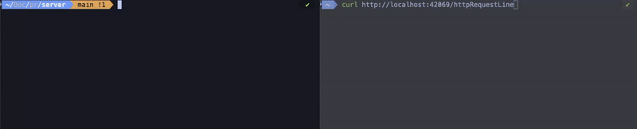

# TypeScript HTTP Server

## Overview

Bare-bones HTTP/1.1 server written in TypeScript using only Node.js core modules.

It establishes raw TCP sockets via `node:net`,

parses incoming requests, and demonstrates how an HTTP server works without relying on frameworks or third-party libraries.

## Features

- **Zero-dependency core** – everything is implemented with Node’s standard library.
- **Streaming request parser** – consumes raw socket data line-by-line to build the HTTP request line.
- **Async utilities** – a minimalist async queue powers the line channel abstraction.
- **TypeScript-first** – strict typing across the server, parser, and utility layers.

## Demo

## Project Structure

src/
├── asyncQueue.ts # Generic async iterable queue used to buffer line reads
├── index.ts # Server bootstrap and connection lifecycle handling
├── lineChannel.ts # Transforms socket chunks into an async line iterator
├── parser.ts # Parses the HTTP request line and validates its parts
└── message.txt # Placeholder for ad-hoc debugging messages

Compiled JavaScript is emitted into `dist/`.

## Getting Started

### Prerequisites

- Node.js 20.x or newer
- npm 10.x (bundled with Node 20)

### Installation

1. Install dependencies: `npm install`
2. Compile the TypeScript source: `npm run build`

### Running the Server

- **Production mode:** `npm run start`
  - Builds the project and starts the TCP listener on port `42069`.
- **Development mode:** `npm run dev`
  - Watches `src/` and rebuilds on change using `nodemon` (restarts the build-and-run script).

Connect with `curl` or a browser: `curl -v http://localhost:42069/`

## How It Works

- `AsyncQueue<T>` implements the asynchronous producer/consumer pattern, letting the server await new lines without blocking.
- `getLinesChannel` accumulates socket chunks until `\r\n`, then yields complete lines through the queue.
- `getRequestLine` pulls the first non-empty line, validates the method, path, and protocol version, and returns a typed `RequestLine`.
- `index.ts` wires everything together, logging each connection and parsed request line.

## Development Notes

- Linting is available via ESLint (`npm run lint` recommended once configured).
- No tests are bundled yet; consider adding unit tests around the parser and async queue.
- The current implementation parses only the request line; header and body parsing are scaffolds for future work.

## Roadmap Ideas

- Parse header fields and request bodies.
- Respond to clients with minimal HTTP responses.
- Add routing and middleware utilities.
- Improve error handling and connection teardown logic.
- Introduce integration tests (e.g., using Node’s `net` module or `supertest` alternatives).

---
